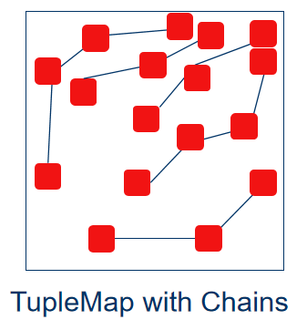

### TupleChain: A Chain Structure of Tuples for Packet Classification

Packet classification is a core component of network functions. New network scenarios such as SDN and NFV require packet classification algorithms to provide both high-speed classification performance and meet high-speed update requirements in large-scale rule sets. This project implements a new algorithm, called TupleChain, for connecting tuples into chains based on the tuple space search algorithm.

The algorithm idea is as follows:

There is a relationship between the entries in the hash table of different tuples, that is, the key corresponding to the entry in the tuple with a shorter prefix length can always be included by that in the tuple with a longer prefix length. Therefore, different tuples can be associated to form a corresponding relationship between their entries.

Tuples are linked to each other to form a chain. Since the tuples on the chain have a front-end relationship, the access to the tuples on the chain can be accelerated by binary search, that is, the chain can be built into a binary search tree. The framework diagram of this algorithm in tuple space is shown below.

